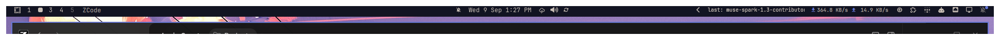

# 9Router Monitor for Omarchy

A navbar pill for the [9Router](https://github.com/decolua/9router) dashboard (Omarchy / Quickshell bar widget).



Idle shows the last-used model. While requests flow through the gateway the
pill lights up: white text over a rainbow equalizer backdrop that dances like
an audio visualizer, plus a gentle pulse. Click for a panel with live
requests, recent models, and dashboard login when the session expires.

## What it does

- **Always-visible pill** — `last: <model>` when idle, `<model>` while
  traffic flows, `login needed` (amber) when the dashboard session expires.
- **Live updates** — follows the dashboard SSE stream
  (`/api/usage/stream`), so the pill flips instantly on request
  start/finish instead of waiting for a poll boundary. A slow heartbeat
  poll stays as a safety net and revives a dead stream.
- **Busy detection that actually works** — 9Router only records requests on
  completion, so its `activeRequests` field is effectively always empty.
  The widget treats each newly arrived request as activity and holds the
  busy look for 12s, refreshed by further arrivals.
- **Login UI with persistent session** — password prompt panel when the
  session expires (restarts log the dashboard out). Optional remember via
  the login keyring (`secret-tool`) for silent auto re-login. The password
  travels over process stdin, never argv; cookies live `0600` under
  `~/.local/state/omarchy/9router/`.
- **Fixed-width pill with marquee** — the pill never shifts the bar;
  long model names scroll back and forth, short ones sit centered.
- **Click actions** — left: panel · right: open dashboard · middle: refresh.

## Requirements

- Omarchy with the Quickshell shell (`omarchy-shell`)
- Python 3 (stdlib only — no pip packages)
- `secret-tool` (libsecret) — optional, only for remembered passwords
- A reachable 9Router dashboard (default `http://localhost:20128`)

## Install

```bash
omarchy plugin add https://github.com/jhonoryza/omarchy-9router-monitor --enable --section right
```

Or clone manually and validate:

```bash
git clone https://github.com/jhonoryza/omarchy-9router-monitor ~/.config/omarchy/plugins/jhonoryza.9router
omarchy plugin validate ~/.config/omarchy/plugins/jhonoryza.9router
omarchy plugin enable jhonoryza.9router --section right
```

Point it at your dashboard in the widget settings (`baseUrl`) if it is not
on `http://localhost:20128`.

## Remove

```bash
omarchy plugin remove jhonoryza.9router
rm -rf ~/.local/state/omarchy/9router   # session cookies + last-model cache
secret-tool clear service omarchy-9router account dashboard-password  # remembered password
```

## Files

| File           | Role                                                      |
|----------------|-----------------------------------------------------------|
| `manifest.json`| Plugin metadata + settings schema                         |
| `Service.qml`  | Singleton: polling, SSE tail, login/keyring, shared state |
| `BarWidget.qml`| Navbar pill: text, rainbow + equalizer animation          |
| `Panel.qml`    | Popup: live requests, recent models, login form           |
| `monitor.py`   | Stdlib fetcher: cookie login, one-shot + `--stream` modes |

## Settings

| Key                | Default                 | Meaning                                              |
|--------------------|-------------------------|------------------------------------------------------|
| `dashboardHost`    | `localhost`             | Dashboard host — editable from the panel (CONNECTION section) |
| `dashboardPort`    | `20128`                 | Dashboard listening port — editable from the panel   |
| `baseUrl`          | `http://localhost:20128`| Full URL, legacy fallback when host/port are empty   |
| `refreshSeconds`   | `5`                     | Heartbeat poll interval (stream carries live updates)|
| `showModelLabel`   | `true`                  | `false` leaves only the status dot                   |
| `pillWidth`        | `200`                   | Fixed pill width (120-400); long names marquee inside |
| `rememberPassword` | `true`                  | Store password in keyring for auto re-login          |

## License

MIT — see [LICENSE](LICENSE).

## Security notes

- All dashboard responses are hard-capped (512 KiB, streamed with an
  overflow check) so a faulty or compromised server cannot exhaust the
  shell's memory. Collection sizes and string lengths are capped before
  anything reaches QML state.
- Redirects are restricted to the configured dashboard origin; the cookie
  jar never follows a redirect off-origin.
- The dashboard password is sent over process stdin (never argv) and only
  stored in the login keyring when remember-password is on.
